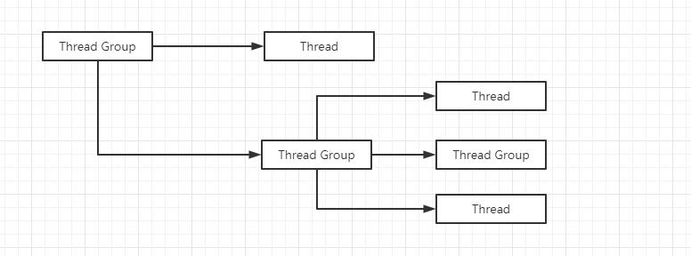

# 认识线程

​		每一个任务就是一个进程，进程内部至少要有一个线程是在运行中，线程也被称为轻量级的进程。

​		每一个线程都有自己的局部变量表、程序计数器（指向正在执行的指令指针）以及各自的生命周期。


## 线程的生命周期

### new状态

​		用`new`关键字创建一个`Thread`对象，没有调用`start`方法启动该线程，那么该线程的状态为`new`状态，此时线程是不存在的。这个对象与用`new`创建的普通

对象没有什么区别。

​		`new`状态通过`start`方法进入`runnable`状态


### runnable状态

​		线程对象进入`runnable`状态必须调用`start`方法，此时才是真正的在`JVM`进程中创建了一个线程，但线程是否运行仍要听令与`CPU`的调度。把这个中间状态

称为可执行状态（`runnable`），此时说明线程具备执行的资格，但并没有真正地执行起来而是在等待`CPU`的调度。

​		`runnable`状态的线程只能意外终止或者进入`running`状态


### running状态

​		线程获得`CPU`后即进入`running`状态。一个正处于`running`状态的线程事实上也是属于`runnable`状态的线程，但反过来就不成立了。

​		可以发生的状态转换：

​				1、直接进入`terminated`状态。比如：调用`stop`方法（不推荐使用）或者判断某个逻辑标识。

​				2、进入`blocked`状态。比如：调用`sleep`、`wait`方法而加入了`waitSet`中。

​				3、进行某个阻塞的`IO`操作而进入`blocked`状态。

​				4、`CPU`放弃该线程而进入`runnable`状态。

​				5、主动调用`yield`方法放弃`CPU`执行权而进入`runnable`状态。


### blocked状态

​		处于运行状态中的线程由于某种原因，暂时放弃对CPU的使用权，停止执行，此时进入阻塞状态，直到其进入到就绪状态，才 有机会再次被`CPU`调用以进入

到运行状态。

​		可以发生的状态转换：

​				1、直接进入`terminated`状态。比如：调用`stop`方法（不推荐使用）或者意外死亡。

​				2、阻塞的操作技术而进入到`runnable`状态。

​				3、完成了指定时间的休眠而进入到`runnable`状态。

​				4、睡眠中的线程被其他线程`notify/notifyall`唤醒而进入到`runnable`状态。

​				5、线程在阻塞过程中被打断而进入`runnalbe`状态。比如：其他线程调用了`interrupt`方法。


### terminated状态

​		一个线程的最终状态，该状态中线程不能切换到其他任何状态。处于此状态意味着线程的整个生命周期都结束了。

​		进入`terminated`状态的情况：

​				1、线程运行正常结束，结束生命周期。

​				2、线程运行出错意外结束。

​				3、`JVM Crash`，导致所有的线程都结束。


```java
// 不能两次调用该方法，否则会抛出 IllegalThreadStateException 异常
// 当线程处于 terminated 状态，不能调用该方法
public synchronized void start() {

    	// 线程处于 new 状态时，该字段的值为 0
        if (threadStatus != 0)
            throw new IllegalThreadStateException();

    	// 线程启动后被加入到一个 ThreadGroup 中
        group.add(this);

        boolean started = false;
        try {
            start0();   // 这个 JNI 方法来调用重写的 run 方法
            started = true;
        } finally {
            try {
                if (!started) {
                    group.threadStartFailed(this);
                }
            } catch (Throwable ignore) {

            }
        }
}


private native void start0();
```

```java
// 此方法称为线程的执行单元
public void run() {
        if (target != null) {
            target.run();
        }
}
```

```java
public class Thread implements Runnable {
    ......
}
```

​		由上面的源码可知：创建线程只有一个方法：构造`Thread`类的实例。实现线程的执行单元有两种方式：1、重写`Thread`的`run`方法。2、实现`Runnable`接口

的`run方法`，并将`Runnable`实例用作构造`Thread`实例的参数。


​		`Thread`类中的`start`方法和`run`方法使用了模板设计模式，即父类编写算法结构，子类实现逻辑细节。

```java
// 模板模式
public class TemplateMethod {

    public final void print(String message)
    {
        System.out.println("##################");
        wrapPrint(message);
        System.out.println("##################");
    }

    protected void wrapPrint(String message)
    {
        System.out.println(message);
    }

    public static void main(String[] args)
    {
        TemplateMethod t1 = new TemplateMethod(){
            @Override
            protected void wrapPrint(String message)
            {
                System.out.println("*" + message + "*");
            }
        };
        t1.print("xiaoshanshan1");


        TemplateMethod t2 = new TemplateMethod(){
            @Override
            protected void wrapPrint(String message)
            {
                System.out.println("+" + message + "+");
            }
        };
        t2.print("xiaoshanshan12");
    }
}
```


​		`Thread`类与`Runnalbe`接口采用了策略模式。并且如果重写`Thread`类的`run`方法，则此执行单元是不能共享的，而使用`Runnable`接口则可以轻松实现该功

能。

```java
// 此程序有线程安全问题
public class TicketWindowRunnalbe implements Runnable {
    private int index = 1;


    private final int MAX = 50;
    @Override
    public void run() {
        while (index <= MAX)
        {
            System.out.println(Thread.currentThread() + "当前号码是:" + index);
            index++;
            try
            {
                Thread.sleep(100);
            }
            catch (Exception e)
            {
                e.printStackTrace();
            }
        }
    }

    public static void main(String[] args)
    {
        TicketWindowRunnalbe runnalbe = new TicketWindowRunnalbe();
        Thread t1 = new Thread(runnalbe);
        Thread t2 = new Thread(runnalbe);
        Thread t3 = new Thread(runnalbe);
        Thread t4 = new Thread(runnalbe);

        t1.start();
        t2.start();
        t3.start();
        t4.start();
    }
}
```


# Thread构造函数

​		如果没有为线程显示的指定一个名字，那么线程将以`Thread-`作为前缀与一个自增数字进行组合。在线程启动之前还有一次修改的机会，线程一旦启动，名字

将不再被修改。

```java
public Thread() 
{
    init(null, null, "Thread-" + nextThreadNum(), 0);
}
```


## 父子关系

```java
private void init(ThreadGroup g, Runnable target, String name,
                      long stackSize, AccessControlContext acc,
                      boolean inheritThreadLocals) 
{
        if (name == null) {
            throw new NullPointerException("name cannot be null");
        }

        this.name = name;

        Thread parent = currentThread(); // 获取当前线程作为父线程
        SecurityManager security = System.getSecurityManager();
        if (g == null) {
            if (security != null) {
                g = security.getThreadGroup();
            }
            if (g == null) {
                g = parent.getThreadGroup();
            }
        }
    
    .......
}
```

​		通过上面的源码可以看出：

​				一个线程的创建肯定是由另一个线程完成的。

​				被创建线程的父线程是创建它的线程。

​				如果在构造`Thread`的时候没有显示地指定一个`ThreadGroup`，那么子线程将会被加入到父线程所在的线程组。还会拥有和父线程一样的优先级，同样的

​		`daemon`。

## 守护线程

​		`Java`将线程分为两类：用户线程和守护线程。两者并没有多大的区别，唯一的不同在于虚拟机的退出：当`JVM`中只剩下守护线程时，`JVM`会退出即程序终

止。但如果`JVM`中有用户线程没有执行完，那么`JVM`是不会退出的。即守护线程的生命周期与`JVM`相同。

​		特点：

​				守护进程是运行在程序后台的线程。

​				守护进程创建的进程，依然是守护进程。

​				守护进程不会影响`JVM`的退出，当`JVM`只剩余守护进程时，`JVM`进行退出。

​				守护进行在`JVM`退出时，自动销毁。

​		通常守护线程用来为系统中的其他对象和线程提供服务，典型的守护线程就是`GC`线程。

​		`Java`内存结构中虚拟机栈的大小将直接觉得一个`JVM`进程中可以创建线程的数量。


# API

## sleep

​		该方法是一个静态方法，有两个重载方法：

```java
public static native void sleep(long millis) throws InterruptedException;
public static void sleep(long millis, int nanos) throws InterruptedException
{
    if (millis < 0) 
    {
    	throw new IllegalArgumentException("timeout value is negative");
    }

    if (nanos < 0 || nanos > 999999) 
    {
    	throw new IllegalArgumentException("nanosecond timeout value out of range");
    }
    if (nanos >= 500000 || (nanos != 0 && millis == 0)) 
    {
    	millis++;
    }
    sleep(millis);
}
```

​		上面两个方法都会使当前线程进入指定毫秒数的休眠，暂停执行，但是最终要以系统的定时器和调度器的精度为准，其有一个重要的特性：不会放弃`monitor`

锁的所有权。

​		在`JDK 1.5`之后，引入一个一个枚举类：`TimeUnit`，其对`sleep`进行了封装，可以省去时间单元的换算步骤。


## yield

​		该方法属于一个启发式的方法，会提醒调度器我愿意放弃当前的`CPU`资源，如果`CPU`的资源不紧张，则会忽略这种提醒。如果没有忽略则会使当前线程从

`running`状态切换到`runnable`状态。

​		与`sleep`的区别：

​				`sleep`会导致当前线程暂停指定的时间，没有`CPU`时间片的消耗。

​				`yield`只是对`CPU`调度器的一个提示，如果`CPU`调度器没有忽略这个提示，它会导致线程上下文的切换。

​				`sleep`会使线程短暂`block`，会在给定的时间内释放`CPU`资源。

​				`yield`会使`running`状态的`Thread`进入`runnable`状态`(`如果`CPU`调度没有忽略这个提示的话`)`。

​				`sleep`几乎百分之百地完成了给定时间的休眠，而`yield`的提示并不能一定担保。

​				一个线程`sleep`另一个线程调用`interrupt`会捕获到中断信号，而`yield`则不会。


## 优先级

```java
public final void setPriority(int newPriority); // 设置优先级public final int getPriority(); //获取优先级
```

​		设置线程的优先级同样也是一个提醒操作：

​				对于`root`用户，会提醒操作系统你想要设置的优先级，否则它会被忽略。

​				如果`CPU`比较忙，设置优先级可能会获得更多的`CPU`时间片，但是闲时优先级的高地几乎不会有任何作用。

​		优先级的范围在`1~10`，如果指定的线程优先级大于线程所在线程组的优先级，那么指定的优先级将会失效，取而代之的是线程组的最大优先级。

​		线程默认的优先级和它的父线程保持一致，一般情况下都是`5`，因为`main`线程的优先级为`5`。


## ID

```java
public long getId();
```

​		该方法会获取线程的唯一`ID	`，线程的`ID`在整个`JVM`进程中都是唯一的，并且都是从`0`开始逐次递增。但实际自己创建的线程并不会从`0`开始，因为`JVM`进

程启动的时候，实际上开辟了很多线程。


## 获取当前线程

```java
public static native Thread currentThread();
```

​		该方法会返回当前执行线程的引用。


## 线程上下文类加载器

```java
public static native Thread currentThread(); // 获取线程上下文的类加载器，即该线程是由那个类加载器加载的，如果没有修改则与父线程保持一致
public void setContextClassLoader(ClassLoader cl); // 设置线程的类加载器，该方法可以打破 Java 类加载器的父委托机制，有时候该方法也被称为 Java 类加载器的后门。
```


## 中断

### interrupt

​		下面的方法都会使当前线程进入阻塞状态，调用当前线程的`interrupt`方法可以打断阻塞。

- `Object`的`wait`方法。
- `Object`的`wait(long)`方法。
- `Object`的`wait(long,int)`方法。
- `Thread`的`sleep(long)`方法。
- `Thread`的`sleep(long,int)`方法。
- `Thread`的`join`方法。
- `Thread`的`join(long)`方法。
- `Thread`的`join(long,int)`方法。
- `InterruptibleChannel`的`io`操作。
- `Seletor`的`wakeup`方法。
- 等等


​		上面的方法会使当前线程进入阻塞状态，若另外一个线程调用被阻塞线程的`interrupt`犯法，则会打断这种阻塞，这种方法也被称为可中断方法。

​		一个线程在阻塞的情况下被打断，都会抛出一个`InterruptedException`异常。


### isInterrupted

​		该方法是`Thread`的一个成员方法，主要判断当先线程是否被中断，该方法仅仅是对中断标识的一个判断，并不会影响标识发生任何改变。


### interrupted

​		该方法是一个静态方法，也用于判断当前线程是否被中断，但调用该方法还会擦除掉线程的中断标识`(`由`true`设置为`false)`。如果当前线程被打断，那么

第一次调用该方法会返回`true`，并且立即擦出了中断标识，第二次包括以后永远都会返回`false`，除非在此期间线程又一次被打断。


```java
public static boolean interrupted() {	return currentThread().isInterrupted(true);}public boolean isInterrupted() {	return isInterrupted(false);}private native boolean isInterrupted(boolean ClearInterrupted);  // 该参数用来控制是否擦除线程的中断标识
```


## join

​		该方法同样也是一个可中断的方法。线程`B join`线程`A`，那么线程`B`会进入等待，直到线程`A`结束声明周期，或者到达给定的时间，在此期间线程`B`都处

于`blocked`状态。


# 线程安全与数据同步

​		共享资源是指多个线程同时对同一份资源进行访问，被多个线程访问的资源就称为共享资源，保证多个线程访问到的数据的一致性被称为数据同步或资源同

步。

​		出现数据不同步的情况的原因就是多个线程对共享资源同时操作引起的，在`JDK 1.5`以前，如果需要解决这个问题需要用到**`synchronized`**关键字，其提供了

一个排他机制，能保证在同一时间只能有一个线程执行某些操作（准确地讲应该是某线程获取了与共享变量关联的`monitor锁`），从而防止数据不一致问题的出

现。

​		**`synchronized`**关键字包括`monitor enter`和`monitor exit`两个`JVM`指令，能够保证在任何时候任何线程执行到`monitor enter`成功之前都必须从主内存中获

取数据，而不是从缓存中，在`monitor exit`运行成功之后，共享变量被更新后的值必须刷入主内存。

​		`synchronized`的指令严格遵从，一个`monitor exit`指令之前必定要有一个`monitor enter`。

​		`synchronized`可以用于对代码块或方法进行修饰，而不能够对类和变量进行修饰。

```java
public class Mutex{    private final static Object MUTEXT = new Object();    public void accessResource()    {        synchronized (MUTEXT)        {            try            {                TimeUnit.MINUTES.sleep(10);            }            catch (InterruptedException e)            {                e.printStackTrace();            }        }    }    public static void main(String[] args)    {        final Mutex mutex = new Mutex();        for(int i  = 0 ; i < 5 ; i++)        {            new Thread(mutex::accessResource).start();        }    }}
```

​		运行上方代码，通过`JConsole`工具或者`jstack`命令查看创建的五个线程线程信息，任何时间只有一个其中一个线程处于`TIMED_WAITING(sleeping)`状态，其

余的未运行完的线程都处于`BLOCKED`状态。

```tex
/**
	getstatic:从class中获得静态属性
	astore_<n>:存储引用到本地变量表
	aload_<n>:从本地变量表加载引用
*/

public void accessResource();
    Code:
       0: getstatic     #2                  // Field MUTEXT:Ljava/lang/Object;   获取MUTEX
       3: dup
       4: astore_1
       5: monitorenter														// 执行 monitor enter JVM指令				
       6: getstatic     #3                  // Field java/util/concurrent/TimeUnit.MINUTES:Ljava/util/concurrent/TimeUnit;
       9: ldc2_w        #4                  // long 10l
      12: invokevirtual #6                  // Method java/util/concurrent/TimeUnit.sleep:(J)V
      15: goto          23					// 跳转到 23 行
      18: astore_2
      19: aload_2
      20: invokevirtual #8                  // Method java/lang/InterruptedException.printStackTrace:()V
      23: aload_1
      24: monitorexit						// 执行 monitor exit JVM指令
      25: goto          33
      28: astore_3
      29: aload_1
      30: monitorexit
      31: aload_3
      32: athrow
      33: return
```


`monitor enter`:

​		每个对象都与一个`monitor`相关联，一个`monitor`的`lock`的锁只能被一个线程在同一时间获得。当线程尝试获得与对象关联的`monitor`的所有权时：

​				如果`monitor`的计数器为0，则标识该`monitor`的`lock`还没有被获得，线程获得之后将立即对该计数器加一，从此该线程就是这个`monitor`的所有者

​		了。

​				如果一个已经拥有该`monitor`所有权的线程重入，会导致`monitor`计数器累加。

​				如果`monitor`已经被其他线程所拥有，则其他线程尝试获取该`monitor`的所有权时，会被陷入阻塞状态直到`monitor`计数器变为0，才能再次尝试获取

​		对`monitor`的所有权。

`monitor exit`:

​		释放对`monitor`的所有权，想要释放对某个对象关联的`monitor`的所有权的前提是：曾经获得了所有权，释放`monitor`所有权的过程比较简单，就是对

`monitor`的计数器减一，如果计数器为0，意味着该线程不在拥有对该`monitor`的所有权，即解锁。同时被该`monitor`阻塞的线程将再次尝试获得对该`monitor`的

所有权。


`synchronized`的注意事项：

​		1、与`monitor`关联的对象不能为空。

​		2、`synchronized`的作用域不能太大，不然会失去并发优势。

​		3、同一类的不同实例之间的`monitor`是彼此独立，即`monitor`是与具体实例相关联的。

​		4、多个锁的交叉容易引起线程死锁。


​		多个线程访问同一个类中多个被`synchronized`的实例方法时，多个线程争夺的`monitor`是同一个实例，即不会出现多个方法同时运行的情况。

​		多个线程访问同一个类中多个被`synchronized`的静态方法时，也不会出现多个方法同时运行的情况。但多个线程争夺的`monitor`是属于`xxx.class`的。


死锁的原因：

​		1、交叉锁可能导致死锁。

​		2、内存不足。

​		3、一问一答式的数据交换。

​		4、数据库锁。

​		5、文件锁。

​		6、死循环引起的死锁。


# 线程间通信

## 单线程间通信

`wait`方法：

```java
public final void wait(long timeout, int nanos) throws InterruptedException;
public final void wait() throws InterruptedException;
public final native void wait(long timeout) throws InterruptedException;
```

​		三个重载方法最终都会调用`wait(long timeout)`方法。

​		`Object`的`wait(long timeout)`方法会导致当前线程进入阻塞，知道有其他线程调用了`Object`的`notify`或`notifyAll`方法才能将其唤醒，或者阻塞时间到达

了`timeout`时间而自动唤醒。

​		`wait`方法必须拥有该对象的`monitor`，即`wait`方法必须咋同步方法或者同步块中使用。

​		当前线程执行了该对象的`wait`方法之后，将会放弃对该`monitor`的所有权并且进入与该对象关联的`wait set`中，每个对象都有一个与之关联的`wait set`。

其他线程将有机会继续争抢该`monitor`的所有权。

​		`wait`方法是可中断方法，当前线程一旦调用了`wait`方法进入阻塞状态，其他线程是可以使用`interrupt`方法将其打断的。打断后会抛出

`InterruptedException`，同时`interrupt`标识也会被擦除。

​		当线程进入`wait set`后，`notify`方法可以将其唤醒，也就是从`wait set`中弹出，同时中断`wait`中的线程也会被唤醒。

`notify`方法：

```java
public final native void notify();
```

​		唤醒单个正在执行该对象`wait`方法的线程。

​		如果有某个线程是由于执行该对象的`wait`方法而进入阻塞则会被唤醒，如果没有则会忽略。

​		被唤醒的线程需要重新获取对该对象所关联`monitor`的`lock`才能继续执行。


​		同步代码的`monitor`必须与执行`wait、notify`方法的对象一致，即用哪个对象的`monitor`进行同步，就只能用哪个对象进行`wait`和`notify`操作。


`wait`与`sleep`：

​		`wait`和`sleep`方法都可以使线程进入阻塞状态。

​		`wait`和`sleep`方法均是可中断方法，被中断后都会抛出异常。

​		`wait`是`Object`的方法，而`sleep`是`Thread`特有的方法。

​		`wait`方法的执行必须在同步方法或者同步代码块中，而`sleep`则不需要。

​		线程在同步方法或者同步块中执行`sleep`方法时，并不会释放`monitor`的锁，而`wait`方法则会释放`monitor`锁。

​		`sleep`方法短暂休眠之后会主动退出阻塞，而`wait()`方法则需要被其他线程中断后才能退出阻塞。

```java
public class EventQueue{    private final int max;    static class Event{}    private final LinkedList<Event> eventQueue = new LinkedList<>();    private final static int DEFAULT_MAX_EVENT = 10;    public EventQueue()    {        this(DEFAULT_MAX_EVENT);    }    public EventQueue(int max)    {        this.max = max;    }    public void offer(Event event)    {        synchronized (eventQueue)        {            if(eventQueue.size() >= max)            {                try                {                    console(" the queue is full.");                        eventQueue.wait();                }                catch (InterruptedException e)                {                    e.printStackTrace();                }            }            console(" the new event is submitted");            eventQueue.addLast(event);            eventQueue.notify();        }    }    public Event take()    {        synchronized (eventQueue)        {            if(eventQueue.isEmpty())            {                try                {                    console(" the queue is empty");                    eventQueue.wait();                }                catch (InterruptedException e)                {                    e.printStackTrace();                }            }            Event event = eventQueue.removeFirst();            this.eventQueue.notify();            console(" the event " + event + " is handled");            return event;        }    }    public void console(String message)    {        System.out.printf("%s:%s\n",Thread.currentThread().getName(),message);    }        public static void main(String[] args)    {        final EventQueue eventQueue = new EventQueue();        new Thread(() ->{           for(;;)           {               eventQueue.offer(new EventQueue.Event());           }        },"Producer").start();        new Thread(() ->        {           for(;;)           {               eventQueue.take();               try               {                   TimeUnit.SECONDS.sleep(3);               }               catch (InterruptedException e)               {                   e.printStackTrace();               }           }        },"Consumer").start();    }}
```


## 多线程间通信

​		`notify`方法每次只能唤醒`wait set`中的其中一个线程，而`notifyAll`方法则可以同时其中的所有线程，同样被唤醒的线程仍需要继续争抢`monitor`锁。

```java
public void offer(Event event)
    {
        synchronized (eventQueue)
        {
            while (eventQueue.size() >= max)  // 将上面的 if 换成了 while
            {
                try
                {
                    console(" the queue is full.");
                        eventQueue.wait();
                }
                catch (InterruptedException e)
                {
                    e.printStackTrace();
                }
            }

            console(" the new event is submitted");
            eventQueue.addLast(event);
            eventQueue.notifyAll();   // notify 换成 notifyAll
        }
    }

    public Event take()
    {
        synchronized (eventQueue)
        {
            while(eventQueue.isEmpty())
            {
                try
                {
                    console(" the queue is empty");
                    eventQueue.wait();
                }
                catch (InterruptedException e)
                {
                    e.printStackTrace();
                }
            }

            Event event = eventQueue.removeFirst();
            this.eventQueue.notifyAll();
            console(" the event " + event + " is handled");
            return event;
        }
    }
```


## synchronized的缺陷

​		synchronized关键字提供了一种排他式的数据同步机制，某个线程在获取`monitor lock`的时候可能会被阻塞：

​				1、无法控制阻塞时长。

​				2、阻塞不可中断。

```java
public class SynchronizedDefect{    public synchronized void syncMethod()    {        try        {            TimeUnit.HOURS.sleep(1);        }        catch (InterruptedException e)        {            e.printStackTrace();        }    }    public static void main(String[] args) throws Exception    {        SynchronizedDefect defect = new SynchronizedDefect();        Thread t1 = new Thread(defect::syncMethod,"t1");        t1.start();        TimeUnit.MILLISECONDS.sleep(2);        Thread t2 = new Thread(defect::syncMethod,"t2");        t2.start();        TimeUnit.MILLISECONDS.sleep(2);        t2.interrupt();        System.out.println(t2.isInterrupted());  // true：synchronized 的阻塞不可中断        System.out.println(t2.getState());  // BLOCKED    }}
```


解决实例：

```java
public interface Lock
{
    void lock() throws InterruptedException;

    void lock(long mills) throws InterruptedException, TimeoutException;

    void unlock();

    List<Thread> getBlockedThreads();
}
public class BooleanLock implements Lock
{
    private Thread currentThread;

    private boolean locked = false;

    private final List<Thread> blockedList = new ArrayList<>();


    @Override
    public void lock() throws InterruptedException
    {
        synchronized (this)
        {
            while (locked)
            {
                final Thread temp = Thread.currentThread();
                try
                {
                    if (!blockedList.contains(temp)) ;
                    {
                        blockedList.add(temp);
                    }
                    this.wait();
                }
                catch (InterruptedException e)
                {
                    blockedList.remove(temp);
                    throw e;
                }
            }

            blockedList.remove(Thread.currentThread());
            this.locked = true;
            this.currentThread = Thread.currentThread();
        }
    }

    @Override
    public void lock(long mills) throws InterruptedException, TimeoutException
    {
        synchronized (this)
        {
            if(mills <= 0)
            {
                this.lock();
            }
            else
            {
                long remainingMills = mills;

                long endMills = System.currentTimeMillis() + remainingMills;

                while (locked)
                {

                    final Thread temp = Thread.currentThread();

                    if(remainingMills <= 0)
                    {
                        throw new TimeoutException("can not get the lock during " + mills + " ms.");
                    }
                    try
                    {
                        if(!blockedList.contains(temp))
                        {
                            blockedList.add(temp);
                        }
                        this.wait(remainingMills);
                    }
                    catch (InterruptedException e)
                    {
                        blockedList.remove(temp);
                        throw e;
                    }
                    remainingMills = endMills - System.currentTimeMillis();
                }
                blockedList.remove(Thread.currentThread());
                this.locked = true;
                this.currentThread = Thread.currentThread();
            }
        }
    }

    @Override
    public void unlock()
    {
        synchronized (this)
        {
            if(currentThread == Thread.currentThread())
            {
                this.locked = false;
                Optional.of(Thread.currentThread().getName() + " release the lock.").ifPresent(System.out::println);
                this.notifyAll();
            }
        }
    }

    @Override
    public List<Thread> getBlockedThreads() {
        return Collections.unmodifiableList(blockedList);
    }
}

public class TestBooleanLock
{
    private final Lock lock = new BooleanLock();

    public void syncMethod()
    {
        try
        {
            lock.lock();
            int randomInt = ThreadLocalRandom.current().nextInt(10);
            System.out.println(Thread.currentThread() + " get the lock.");
            TimeUnit.SECONDS.sleep(randomInt);
        }
        catch (InterruptedException e)
        {
            e.printStackTrace();
        }
        finally
        {
            lock.unlock();
        }
    }

    public void syncMeThodTimeoutable()
    {
        try
        {
            lock.lock(1000);
            int randomInt = ThreadLocalRandom.current().nextInt(10);
            System.out.println(Thread.currentThread() + " get the lock.");
            TimeUnit.SECONDS.sleep(randomInt);
        }
        catch (InterruptedException | TimeoutException e)
        {
            e.printStackTrace();
        }
        finally
        {
            lock.unlock();
        }
    }

    public static void main(String[] args) throws Exception
    {
        TestBooleanLock test = new TestBooleanLock();

        // 多个线程通过 lock 方法争抢锁
        //IntStream.range(0,10).mapToObj(i -> new Thread(test::syncMethod)).forEach(Thread::start);

        // 可中断被阻塞的线程
        /*new Thread(test::syncMethod,"t1").start();
        TimeUnit.MILLISECONDS.sleep(2);
        Thread t2 = new Thread(test::syncMethod, "t2");
        t2.start();
        TimeUnit.MILLISECONDS.sleep(10);
        t2.interrupt();*/

        // 阻塞的线程可超时
        new Thread(test::syncMethod,"t1").start();
        TimeUnit.MILLISECONDS.sleep(2);
        Thread t2 = new Thread(test::syncMeThodTimeoutable, "t2");
        t2.start();
        TimeUnit.MILLISECONDS.sleep(10);
    }
}
```


# ThreadGroup

​		创建线程的时候如果没有显示地指定`ThreadGroup`，那么新的线程会被加入到与父线程相同的`ThreadGroup`中。

​		默认情况下，新的线程都会被加入到`main`线程所在的`group`中，`main`线程的`group`名字同线程名。与线程一样`ThreadGroup`同样存在父子关系。



```java
public ThreadGroup(String name);   // 使用此方法创建的 ThreadGroup 的父 ThreadGroup 是创建它的线程所在的 ThreadGroup。public ThreadGroup(ThreadGroup parent, String name);
```

```java
public class ThreadGroupCreator{    public static void main(String[] args)    {        ThreadGroup currentGroup = Thread.currentThread().getThreadGroup();        ThreadGroup group1 = new ThreadGroup("group1");        System.out.println(group1.getParent() == currentGroup);        ThreadGroup group2 = new ThreadGroup(group1,"group2");        System.out.println(group2.getParent() == group1);    }}/*truetrue*/
```


## 复制

### 复制线程

​		一个`ThreadGroup`中会加入若干个线程以及子`ThreadGroup`，下面的方法可以复制出线程和线程组。

```java
public int enumerate(Thread list[]); // 相当于调用 enumerate(list,true)public int enumerate(Thread list[], boolean recurse);
```

​		上面的方法都会将`ThreadGroup`中的`active`线程全部复制到`list`数组中，第二个方法，如果`recurse`为`true`，该会把所有子`group`中的`active`线程都递

归到`list`数组中。这两个方法都会调用下面的方法：

```java
private int enumerate(Thread list[], int n, boolean recurse) {        int ngroupsSnapshot = 0;        ThreadGroup[] groupsSnapshot = null;        synchronized (this) {            if (destroyed) {                return 0;            }            int nt = nthreads;            if (nt > list.length - n) {                nt = list.length - n;            }            for (int i = 0; i < nt; i++) {                if (threads[i].isAlive()) {                    list[n++] = threads[i];                }            }            if (recurse) {                ngroupsSnapshot = ngroups;                if (groups != null) {                    groupsSnapshot = Arrays.copyOf(groups, ngroupsSnapshot);                } else {                    groupsSnapshot = null;                }            }        }        if (recurse) {            for (int i = 0 ; i < ngroupsSnapshot ; i++) {                n = groupsSnapshot[i].enumerate(list, n, true);            }        }        return n;}
```

​		上面的两个方法获取到的线程仅仅是个估计值，并不能百分百保证当前`group`的活跃线程。并且比起数组的长度，方法的返回值更为真实，因为其仅仅只是

将当前活跃的`Thread`分组放进数组中，而返回值则代表真实的数量，而不是数组的长度。


```java
public int enumerate(ThreadGroup list[]);public int enumerate(ThreadGroup list[], boolean recurse);
```

​		上面的方法主要用于复制当前`ThreadGroup`的子`Group`，同样`recurse`会决定是否以递归的方式复制。

```java
	public static void main(String[] args) throws Exception    {        ThreadGroup g1 = new ThreadGroup("g1");        ThreadGroup g2 = new ThreadGroup(g1,"g2");        TimeUnit.MILLISECONDS.sleep(2);        ThreadGroup mainGroup = Thread.currentThread().getThreadGroup();        ThreadGroup[] list = new ThreadGroup[mainGroup.activeGroupCount()];        int recurseSize = mainGroup.enumerate(list);        System.out.println(recurseSize);        recurseSize = mainGroup.enumerate(list,false);        System.out.println(recurseSize);    }/*	2	1*/
```


​		`ThreadGroup`并不能提供对线程的管理，`ThreadGroup`的主要功能是对线程进行组织。

```java
public int activeCount(); // 获取 group 中活跃的线程数，估计值，并不能百分之百地保证数字一定正确，该方法会递归获取其他子 group 中的活跃线程。public int activeGroupCount(); // 获取 group 的活跃的子 group，这也是一个估计值，也会递归获取所有的子 group。public final int getMaxPriority(); // 获取 group 的优先级，默认情况下, Group 的优先级为 10，所有线程的优先级都不能大于 group 的优先级。public final String getName(); // 获取 group 的名字。public final ThreadGroup getParent(); // 获取 group 的父 group ，如果父 group 不存在，则会返回 null。public void list(); // 执行该方法会将 group 中所有的活跃线程的信息全部输出到控制台。public final boolean parentOf(ThreadGroup g); // 判断当前 group 是不是给定 group 的父 group，如果给定的 group 就是它自己，则也会返回 true。public final void setMaxPriority(int pri); // 设置 group 的最大优先级，最大优先级不能超过父 group 的最大优先级，不仅会改变当前 group 最大优先级，而且会改变所有子 group 的最大优先级。同时，改变 group 的优先级之后，会出现 线程的优先级大于 group 的优先级的情况，但后序加入的线程的优先级是不会大于 group 的优先级。
```

```java
	public static void main(String[] args) throws Exception
    {
        ThreadGroup group = new ThreadGroup( "g1");
        Thread thread = new Thread(group,() ->
        {
            while (true)
            {
                try
                {
                    TimeUnit.SECONDS.sleep(1);
                }
                catch (Exception e)
                {
                    e.printStackTrace();
                }
            }
        },"thread");
        thread.setDaemon(true);
        thread.start();
        System.out.println("group.getMaxPriority()=" + group.getMaxPriority());
        System.out.println("thread.getPriority()=" + thread.getPriority());
        group.setMaxPriority(3);
        System.out.println("group.getMaxPriority()=" + group.getMaxPriority());
        System.out.println("thread.getPriority()=" + thread.getPriority());
    }
/*
group.getMaxPriority()=10
thread.getPriority()=5
group.getMaxPriority()=3
thread.getPriority()=5
*/
```


## interrupt

​		`interrupt`一个`thread group`会导致该`group`中所有的`active`线程都被`interrupt`，也就是说该`group`中每一个线程的`interrupt`标识都被设置了。

```java
	public final void interrupt() {
        int ngroupsSnapshot;
        ThreadGroup[] groupsSnapshot;
        synchronized (this) {
            checkAccess();
            for (int i = 0 ; i < nthreads ; i++) {
                threads[i].interrupt();
            }
            ngroupsSnapshot = ngroups;
            if (groups != null) {
                groupsSnapshot = Arrays.copyOf(groups, ngroupsSnapshot);
            } else {
                groupsSnapshot = null;
            }
        }
        for (int i = 0 ; i < ngroupsSnapshot ; i++) {
            groupsSnapshot[i].interrupt();
        }
    }
```

```java
    public static void main(String[] args) throws Exception    {        ThreadGroup group = new ThreadGroup("g1");        new Thread(group,() ->        {            while (true)            {                try                {                    TimeUnit.MILLISECONDS.sleep(2);                }                catch (Exception e)                {                    break;                }            }            System.out.println("t1 will exit.");        },"t1").start();        new Thread(group,() ->        {            while (true)            {                try                {                    TimeUnit.MILLISECONDS.sleep(1);                }                catch (Exception e)                {                    break;                }            }            System.out.println("t2 will exit.");        },"t2").start();        group.interrupt();    }/*	t1 will exit.	t2 will exit.*/
```


## destroy

​		`destroy`用于销毁`ThreadGroup`，该方法只是针对一个没有任何`active`线程的`group`进行一个`destroy`标记，调用该方法的直接结果是在父`group`中将自

己移除。


守护`ThreadGroup`

​		`ThreadGroup`也可以设置为守护`ThreadGroup`，将`ThreadGroup`设置为`daemon`，并不会影响线程的`daemon`属性，如果一个`ThreadGroup`的`daemon`被设置为

`true`，那么在`group`中没有任何`active`线程的时候该`group`将自动`destroy`。


# Hook线程以及捕获线程执行异常

处理运行时异常的`API`：

```java
public void setUncaughtExceptionHandler(UncaughtExceptionHandler eh); // 为某个特定线程指定UncaughtExceptionHandlerpublic static void setDefaultUncaughtExceptionHandler(UncaughtExceptionHandler eh); // 设置全局的UncaughtExceptionHandlerpublic UncaughtExceptionHandler getUncaughtExceptionHandler(); // 获取特定线程的UncaughtExceptionHandlerpublic static UncaughtExceptionHandler getDefaultUncaughtExceptionHandler(); // 获取全局的UncaughtExceptionHandler
```


​		线程在执行执行单元中是不允许抛出`checked`异常的，而且线程运行在自己的上下文中，派生它的线程将无法直接获得它运行中的异常信息，因此提供了一

个`UncaughtExceptionHandler`接口，当线程在运行过程中出现异常时，会回调`UncaughtExceptionHandler`接口，从而得知是哪个线程在运行时出错，以及出现了

什么样的错误。

```java
	@FunctionalInterface // 该注解只能标注在有且只有一个抽象方法的接口上    public interface UncaughtExceptionHandler {        void uncaughtException(Thread t, Throwable e);    }
```

​		上面的接口会被`Thread`的`dispatchUncaughtException`方法调用。当线程在运行过程中出现异常时，`JVM`会调用`dispatchUncaughtException`方法，该方法会

将对应线程的实例以及异常信息传递给回调接口。

```java
private void dispatchUncaughtException(Throwable e) {        getUncaughtExceptionHandler().uncaughtException(this, e);}
```

```java
	public static void main(String[] args) throws Exception
    {
        Thread.setDefaultUncaughtExceptionHandler((t,e) ->
        {
            System.out.println(t.getName() + " occur exception");
            e.printStackTrace();
        });

        final Thread thread = new Thread(() ->
        {
            try
            {
                TimeUnit.SECONDS.sleep(2);
            }
            catch (Exception e)
            {

            }
            System.out.println(1 / 0);
        },"test-thread");
        thread.start();
    }
```


```java
/*
	Thread
*/
public UncaughtExceptionHandler getUncaughtExceptionHandler() {
        return uncaughtExceptionHandler != null ?
            uncaughtExceptionHandler : group;
}
// 首先判断当前线程是否设置了handler，有则执行线程自己的uncaughtException方法，没有则到所在的 ThreadGroup 中获取。

/*
	ThreadGroup
*/
public void uncaughtException(Thread t, Throwable e) {
        if (parent != null) {
            parent.uncaughtException(t, e);
        } else {
            Thread.UncaughtExceptionHandler ueh =
                Thread.getDefaultUncaughtExceptionHandler();
            if (ueh != null) {
                ueh.uncaughtException(t, e);
            } else if (!(e instanceof ThreadDeath)) {
                System.err.print("Exception in thread \""
                                 + t.getName() + "\" ");
                e.printStackTrace(System.err);
            }
        }
}
// 该 ThreadGroup 如果有父 ThreadGroup ，则直接调用父 Group 的uncaughtException方法。
// 如果设置了全局默认的 UncaughtExceptionHandler，则调用 uncaughtException 方法。
// 既没有父 ThreadGroup ，也没有全局默认的 UncaughtExceptionHandler，则会直接将异常的堆栈信息定向到的System.err中。
```


```java
	public static void main(String[] args) throws Exception    {        ThreadGroup mainGroup = Thread.currentThread().getThreadGroup();        System.out.println(mainGroup.getName());        System.out.println(mainGroup.getParent());        System.out.println(mainGroup.getParent().getParent());        final Thread thread = new Thread(() ->        {            try            {                TimeUnit.SECONDS.sleep(2);            }            catch (Exception e)            {                e.printStackTrace();            }            System.out.println(1 / 0);        },"test-thread");        thread.start();    }
```


## Hook线程

​		`JVM`线程的退出是由于`JVM`进程中没有活跃的非守护线程，或者收到了系统中断信号，向`JVM`程序注入一个`Hook`线程，在`JVM`进程退出的时候，`Hook`线程

会启动执行，通过`Runtime`可以为`JVM`注入多个`Hook`线程。

```java
	public static void main(String[] args) throws Exception    {        Runtime.getRuntime().addShutdownHook(new Thread()        {            @Override            public void run()            {                try                {                    System.out.println("the hook thread 1 is running");                    TimeUnit.SECONDS.sleep(2);                }                catch (Exception e)                {                    e.printStackTrace();                }                System.out.println("the hook thread 1 will exit");            }        });        Runtime.getRuntime().addShutdownHook(new Thread()        {            @Override            public void run()            {                try                {                    System.out.println("the hook thread 2 is running");                    TimeUnit.SECONDS.sleep(2);                }                catch (Exception e)                {                    e.printStackTrace();                }                System.out.println("the hook thread 2 will exit");            }        });        System.out.println("the program will is stopping");    }
```


实例：防止某个程序被重复启动

```java
public class PreventDuplicated
{
    private final static String LOCK_PATH = System.getProperty("user.dir") + "/file/lock";
    private final static String LOCK_FILE = ".lock";
    private final static String PERMISSIONS = "rw-------";
    private static void checkRunning() throws IOException
    {
        Path path = getLockFile();
        if(path.toFile().exists())
        {
            throw new RuntimeException("the program already running");
        }
        /* Linux
        Set<PosixFilePermission> perms = PosixFilePermissions.fromString(PERMISSIONS);

        Files.createFile(path,PosixFilePermissions.asFileAttribute(perms));*/

        /* Windows
        File file = new File(LOCK_PATH + "/" + LOCK_FILE);
        File parentFile = file.getParentFile();
        if(!parentFile.exists())
        {
            parentFile.mkdirs();
        }
        file.createNewFile();*/

    }

    private static Path getLockFile()
    {
        return Paths.get(LOCK_PATH,LOCK_FILE);
    }

    public static void main(String[] args) throws Exception
    {
        checkRunning();
        Runtime.getRuntime().addShutdownHook(new Thread(() ->
        {
            System.out.println("the program received kill signal");
            getLockFile().toFile().delete();
        }));
        int count = 0;
        for(;;)
        {
            if(count >= 50)
            {
                break;
            }
            try
            {
                TimeUnit.SECONDS.sleep(1);
                count++;
                System.out.println("program is running");
            }
            catch (Exception e)
            {
                e.printStackTrace();
            }
        }
    }
}
```

​		`Hook`线程只有在收到退出信号的时候才会被执行，如果使用`kill -9`那么`Hook`线程不会得到执行，进程将会立即退出。

​		`Hook`线程也可以执行一些释放资源的工作。

​		尽量不要在`Hook`线程中执行一些耗时非常长的操作，因为其会导致程序迟迟不能退出。


# 线程池原理

​		线程池里面存放这已经创建好的线程，当有任务提交给线程池执行时，池子中的某个线程会主动执行该任务，如果池子中的线程数量不够应付数量众多的任务

时，则需要自动扩充新的线程到池子中。池子中的线程能够自动回收，释放资源。为了能够异步地提交任务和缓存未被处理的任务，需要有一个任务队列。

​		完整的线程数需要的因素：

​				1、任务队列：用于缓存提交的任务；

​				2、线程数量管理功能：可以通过三个参数来实现。1)：创建线程池时初始的线程数量`init`；2)：自动扩充时最大的线程数量`max`；3)：活跃线程数或

​		核心线程数量`core`。

​				3、任务拒绝策略：如果线程数量已达到上线且任务队列已满，则需要有相应的拒绝策略来通知任务提交者。

​				4、线程工厂：主要用于个性化定制线程。

​				5、`QueueSize`：任务队列主要存放提交的`Runable`，但是为了防止内存溢出，需要有`limit`数量对其进行控制。

​				6、`Keepedalive`时间：该时间主要决定线程各个重要参数自动维护的时间间隔。

## 自定义线程池

```java
public interface ThreadPool
{
    void execute(Runnable runnable); // 提交任务到线程池
    void shutdown(); // 关闭线程池
    int getInitSize(); // 获取线程池的初始化大小
    int getMaxSize(); // 获取线程池最大的线程数
    int getCoreSize(); //  获取线程池的核心线程数量
    int getQueueSize(); // 获取线程池中用于缓存任务队列的大小
    int getActiveCount(); // 获取线程池中活跃线程的数量
    boolean isShutdown(); // 查看线程池是否被关闭
}
```

```java
public interface RunnableQueue
{
    void offer(Runnable runnable); // 将任务提交至队列中
    Runnable take() throws Exception; // 从队列中获取相应的任务
    int size(); // 获取当前队列Runnable的数量
}
```

```java
public interface ThreadFactory
{
    Thread createThread(Runnable runnable); // 创建线程
}
```

```java
public interface DenyPolicy
{
    void reject(Runnable runnable,ThreadPool threadPool); // 拒绝方法

    class DiscardDenyPolicy implements DenyPolicy // 直接丢掉Runnable任务
    {
        @Override
        public void reject(Runnable runnable,ThreadPool threadPool)
        {

        }
    }

    class AbortDenyPolicy implements DenyPolicy // 抛出RunnableDenyException异常
    {
        @Override
        public void reject(Runnable runnable,ThreadPool threadPool)
        {
            throw new RunnableDenyException("the runnable " + runnable + " will be abort.");
        }
    }

    class RunnerDenyPolicy implements DenyPolicy // 交给调用者的线程直接运行Runnable，而不会被加入到线程池中
    {
        @Override
        public void reject(Runnable runnable,ThreadPool threadPool)
        {
            if(!threadPool.isShutdown())
            {
                runnable.run();
            }
        }
    }
}
```

```java
public class RunnableDenyException extends RuntimeException // 用于通知任务提交者，任务队列已无法在接收新的任务
{
    public RunnableDenyException(String message)
    {
        super(message);
    }
}
```

```java
public class InternalTask implements Runnable // 用于线程池内部{    private final RunnableQueue runnableQueue;    private volatile boolean running = true;    public InternalTask(RunnableQueue runnableQueue)    {        this.runnableQueue = runnableQueue;    }    @Override    public void run()            // 当前任务为 running 并且没有被中断，则其将不会地从 queue 中获取 runnable，然后执行run方法        while (running && !Thread.currentThread().isInterrupted())        {            try            {                Runnable take = runnableQueue.take();                take.run();            }            catch (Exception e)            {                running = false;                break;            }        }    }    public void stop() // 停止当前任务，主要会在线程池的shutdown方法中使用    {        this.running = false;    }}
```

```java
public class LinkedRunnableQueue implements RunnableQueue
{
    private final int limit; // 任务队列的最大容量，构造时传入
    private final DenyPolicy denyPolicy; // 若任务队列中的任务已经满了，则需要执行拒绝策略

    private final LinkedList<Runnable> runnablesList = new LinkedList<>(); // 存放任务的队列

    private final ThreadPool threadPool;


    public LinkedRunnableQueue(int limit,DenyPolicy denyPolicy,ThreadPool threadPool)
    {
        this.limit = limit;
        this.denyPolicy = denyPolicy;
        this.threadPool = threadPool;
    }

    @Override
    public void offer(Runnable runnable)
    {
        synchronized (runnablesList)
        {
            if(runnablesList.size() > limit)
            {
                // 无法容纳新任务，执行拒绝策略
                denyPolicy.reject(runnable,threadPool);
            }
            else
            {
                // 将新任务加入到队尾，唤醒阻塞中的线程
                runnablesList.addLast(runnable);
                runnablesList.notifyAll();
            }
        }
    }

    @Override
    public Runnable take() throws Exception
    {
        synchronized (runnablesList)
        {
            while (runnablesList.isEmpty())
            {
                try
                {
                    // 如果任务队列中没有任务可执行，将当前线程挂起
                    runnablesList.wait();
                }
                catch (Exception e)
                {
                    // 被中断时抛出异常
                    throw e;
                }
            }
            // 从队头中取出一个任务
            return runnablesList.removeFirst();
        }
    }

    @Override
    public int size() {
        synchronized (runnablesList)
        {
            return runnablesList.size();
        }
    }
}
```

```java
public class BasicThreadPool extends Thread implements ThreadPool
{
	// 初始化线程数量
    private final int initSize;
	//线程池最大线程数量
    private final int maxSize;
	// 线程池核心线程数量
    private final int coreSize;
	// 当前活跃的线程数量
    private int activeCount;

    private final ThreadFactory threadFactory;

    private final RunnableQueue runnableQueue;

    private volatile boolean isShutdown = false;

    private final Queue<ThreadTask> threadQueue = new ArrayDeque<>();

    private final static DenyPolicy DEFAULT_DENY_POLICY = new DenyPolicy.DiscardDenyPolicy();

    private final static ThreadFactory DEFAULT_THREAD_FACTORY = new DefaultThreadFactoty();

    private final long keepAliveTime;

    private final TimeUnit timeUnit;


    public BasicThreadPool(int initSize,int maxSize,int coreSize,int queueSize)
    {
        this(initSize,maxSize,coreSize,DEFAULT_THREAD_FACTORY,queueSize,DEFAULT_DENY_POLICY,10,TimeUnit.SECONDS);
    }

    public BasicThreadPool(int initSize,int maxSize,int coreSize,ThreadFactory threadFactory,int queueSize,DenyPolicy denyPolicy,long keepAliveTime,TimeUnit timeUnit)
    {
        this.initSize = initSize;
        this.maxSize = maxSize;
        this.coreSize = coreSize;
        this.threadFactory = threadFactory;
        this.runnableQueue = new LinkedRunnableQueue(queueSize,denyPolicy,this);
        this.keepAliveTime = keepAliveTime;
        this.timeUnit = timeUnit;
        this.init();
    }

    private void  init()
    {
        start();
        for(int i = 0 ; i < initSize ; i++)
        {
            newThread();
        }
    }

    private void newThread()
    {
        InternalTask internalTask = new InternalTask(runnableQueue);
        Thread thread = this.threadFactory.createThread(internalTask);
        ThreadTask threadTask = new ThreadTask(thread,internalTask);
        threadQueue.offer(threadTask);
        this.activeCount++;
        thread.start();
    }

    private void removeThread()
    {
        ThreadTask threadTask = threadQueue.remove();
        threadTask.internalTask.stop();
        this.activeCount--;
    }


    public void run()
    {
        while (!isShutdown && !isInterrupted())
        {
            try
            {
                timeUnit.sleep(keepAliveTime);
            }
            catch (Exception e)
            {
                isShutdown = true;
                break;
            }

            synchronized (this)
            {
                if(isShutdown)
                {
                    break;
                }

                if(runnableQueue.size() > 0 && activeCount < coreSize)
                {
                    for(int i = initSize ; i < coreSize ; i++)
                    {
                        newThread();
                    }
                    // continue的目的在于不想让线程的容量直接达到 maxSize
                    continue;
                }

                if(runnableQueue.size() > 0 && activeCount < maxSize)
                {
                    for(int i = coreSize ; i < maxSize ; i++)
                    {
                        newThread();
                    }
                }

                if(runnableQueue.size() == 0 && activeCount < maxSize)
                {
                    for(int i = coreSize ; i < activeCount ; i++)
                    {
                        removeThread();
                    }
                }
            }
        }
    }

    @Override
    public void execute(Runnable runnable)
    {
        if(this.isShutdown)
        {
            throw new IllegalStateException("the thread pool is destroy");
        }
        this.runnableQueue.offer(runnable);
    }

    @Override
    public void shutdown()
    {
        synchronized (this)
        {
            if(isShutdown)
            {
                return;
            }

            isShutdown = true;

            threadQueue.forEach(threadTask ->
            {
                threadTask.internalTask.stop();
                threadTask.thread.interrupt();
            });
            this.interrupt();
        }
    }

    @Override
    public int getInitSize()
    {
        if(isShutdown)
        {
            throw new IllegalStateException("the thread pool is destroy");
        }
        return this.initSize;
    }

    @Override
    public int getMaxSize() {
        if(isShutdown)
        {
            throw new IllegalStateException("the thread pool is destroy");
        }
        return this.maxSize;
    }

    @Override
    public int getCoreSize() {
        if(isShutdown)
        {
            throw new IllegalStateException("the thread pool is destroy");
        }
        return this.coreSize;
    }

    @Override
    public int getQueueSize() {
        if(isShutdown)
        {
            throw new IllegalStateException("the thread pool is destroy");
        }
        return runnableQueue.size();
    }

    @Override
    public int getActiveCount() {
        synchronized (this)
        {
            return this.activeCount;
        }
    }

    @Override
    public boolean isShutdown() {
        return this.isShutdown;
    }
    
    private static class DefaultThreadFactoty implements ThreadFactory
    {
        private static final AtomicInteger GROUP_COUNTER = new AtomicInteger(1);
        private static final ThreadGroup group = new ThreadGroup("styleThreadPool-" + GROUP_COUNTER.getAndDecrement());
        private static final AtomicInteger COUNTER = new AtomicInteger(0);
        @Override
        public Thread createThread(Runnable runnable) {
            return new Thread(group,runnable,"thread-pool-" + COUNTER.getAndDecrement());
        }
    }
}
```

应用：

```java
public class ThreadPoolTest
{
    public static void main(String[] args) throws Exception
    {
        final ThreadPool threadPool = new BasicThreadPool(2,6,4,1000);

        for(int i = 0 ; i < 20 ; i++)
        {
            threadPool.execute(() ->
            {
                try
                {
                    TimeUnit.SECONDS.sleep(10);
                    System.out.println(Thread.currentThread().getName() + " is running and done.");
                }
                catch (Exception e)
                {
                    e.printStackTrace();
                }
            });
        }

        for(;;)
        {
            System.out.println("getActiveCount:" + threadPool.getActiveCount());
            System.out.println("getQueueSize:" + threadPool.getQueueSize());
            System.out.println("getCoreSize:" + threadPool.getCoreSize());
            System.out.println("getMaxSize:" + threadPool.getMaxSize());
            System.out.println("================================");
            TimeUnit.SECONDS.sleep(3);


			/*线程池销毁
            TimeUnit.SECONDS.sleep(12);
            threadPool.shutdown();
            Thread.currentThread().join();*/
        }
    }
}
```


# 类的加载过程

​		`ClassLoader`的主要责任就是负责加载各种`class`文件到`JVM`中，`ClassLoader`是一个抽象的`class`，给定一个`class`的二进制文件名，`ClassLoader`会尝试

加载并且在`JVM`中生成构造这个类的各个数据结构，然后使其分布在`JVM`对应的内存区域中。

​		类的加载过程大致分为三个：

​				1、加载阶段：主要负责查找并且加载类的二进制数据文件，即`class`文件。

​				2、连接阶段：细分为三个阶段：

​						1)、验证：主要是确保文件的正确性。

​						2)、准备：为类的今天变量分配内存，并且为其初始化默认值。

​						3)、解析：把类中的符号引用转换为直接引用。

​				3、初始化阶段：为类的静态变量赋予正确的初始值（代码编写阶段给定的值）。

​		`JVM`对类的初始化时一个延迟的机制，即使用的是`lazy`的方式，当一个类首次使用的时候才会被初始化，在同一个运行时包（并不是类的包）下，一个

`Class`只会被初始化一次。


## 主动使用与被动使用

​		每个类和接口被`Java`程序首次**主动使用**时才会对其进行初始化，随着`JIT`技术越来越成熟，`JVM`运行期间的编译也越来越智能，不排除`JVM`在运行期间提前

预判并且初始化某个类。

​		6中主动使用的场景：

​				1、通过`new`关键字会导致类的初始化。

​				2、访问**类的静态变量**，包括读取或更新会导致类的初始化。

​				3、访问类的静态方法，会导致类的初始化。

​				4、对某个类进行反射操作，会导致类的初始化。

​				5、初始化子类会导致父类的初始化。但通过子类使用父类的静态变量只会导致父类的初始化。

​				6、执行`main`函数所在的类会导致该类的初始化。

​		除了这6种情况，其余都是被动使用，不会导致类的加载和初始化。

​		特例：

​				1、构造某个类的数组时不会导致该类的初始化。

​				2、引用类的静态常量不会导致类的初始化，但若常量需要进行复杂的计算，那么在类的加载，连接阶段是无法对其进行计算的，需要进行初始化后才能

​		对其赋予正确的值。


## 加载阶段

​		类的加载就是将`class`文件的二进制数据读取到内存中，然后将该字节流所代表的静态存储结构转换为方法区中运行时的数据结构，并且在堆内存中生成一

个该类的`java.lang.Class`对象，作为方法区数据结构的入口。

​		类加载的最终产物就是堆内存中的`class`对象，对同一个`ClassLoader`来讲，不管某个类被加载了多少次，对应到堆内存中的`class`对象始终是同一个。类的

加载是通过一个全限定名来获取二进制数据流，但并没有限定必须通过某种方式去获得。

​				1、通过`class`文件的形式。

​				2、运行时动态生成。

​				3、通过网络获取。

​				4、通过读取`zip`文件获得类的二进制字节流。

​				5、将类的二进制数据存储在数据库的`BLOB`字段类型中。

​				6、运行时生成`class`文件，并且动态加载。

​		类的加载是类加载过程的第一个阶段，并不代表整个类已经加载完成，在某个类完成加载阶段后，虚拟机会将这些二进制字节流按照虚拟机所需的格式存储在

方法区中，然后形成特定的数据结构，随之又在堆内存中实例化一个`java.lang.Class`对象，在类加载的整个声明周期中，加载过程还没有结束，连接阶段是可以

交叉工作的，但总体来讲加载阶段肯定是出现在连接阶段之前的。


## 连接阶段

### 验证

​		验证在连接阶段的主要目的是确保`class`文件的字节流所包含的内容符合当前`JVM`的规范要求，并且不会出现危害`JVM`自身安全得代码，当字节流的信息不

符合要求时，则会抛出`VerigyError`这样的异常或者其子异常。


#### 验证文件格式

​		1、验证文件头部的魔术因子，`class`文件的魔术因子是`0xCAFEBABE`。

​		2、验证主次版本号。

​		3、构成`class`文件的字节流是否存在残缺或者其他附加信息，主要是看`class`的`MD5`指纹。

​		4、常量池中的常量是否存在不被支持的变量类型。

​		5、指向常量池中的引用是否指到了不存在的常量或者该常量的类型不被支持。

​		6、其他信息。

​		对文件格式的验证可以在`class`被初始化之前将一些不符合规范的、恶意的字节流拒之门外，文件格式的验证充当了先锋关卡。


#### 元数据的验证

​		元数据的验证其实是对`class`的字节流进行语义分析的过程，整个语义分析就是为了确保`class`字节流符合`JVM`规范的要求。

​		1、检查这个类是否存在父类，是否实现了某个接口，这些父类和接口是否合法，或者是否真实存在。

​		2、检查该类是否继承了被`final`修饰的类，被`final`修饰的类是不允许被继承并且其中的方法是不运行被重写的。

​		3、检查该类是否为抽象类，如果不是，那么它是否实现了父类的抽象方法或者接口中的所有方法。

​		4、检查方法重载的合法性。

​		5、其他语义验证


#### 字节码验证

​		经过文件格式和元数据语义分析过程之后，还需要对字节码进行进一步的验证。该部分的验证是比较复杂的，主要是验证程序的控制流程。

​		1、保证当前线程在程序计数器中的指令不会跳转到不合法的字节码指令中去。

​		2、保证类型的转换时合法的。

​		3、保证任意时刻，虚拟机栈中的操作栈类型与指令代码都能正确地被执行。

​		4、其他验证。


#### 符号引用验证

​		该验证的主要作用就是验证符号引用转换为直接引用时的合法性。

​		1、通过符号引用的描述字符串全限定名称是否能够顺利地找到相关的类。

​		2、符号引用中的类、字段、方法、是否对当前类可见。

​		3、其他。

​		目的是确保解析动作的顺利执行。


### 准备

​		当一个`class`的字节流通过了所有的验证过程之后，就开始为该对象的类变量，即静态变量，分配内存并设置初始值了。类变量的内存会被分配到方法区

中，不同于实例会被分配到堆内存之中。

​		所谓设置初始值，就是为相应的类变量给定一个相关类型在没有被设置时的默认值。

```java
private static int a = 10; // 在准备阶段，其值为 0
private final static int b = 10; // 被 final 修饰的静态变量不会导致类的初始化，是一种被动使用，所以不存在连接阶段。更为严谨的说法是在类的编译阶段编译器会将 value 生成一个 ConstantValue 属性，直接赋予变量
```


### 解析

​		在解析的过程中照样会交叉一些验证的过程。解析就是在常量池中寻找类、接口、字段和方法的符号引用，并将这些符号引用替换成直接引用的过程。

​		在`anewarray、checkcast、getfield、getstatic、instanceof、invokeinterface、invokespecial、invokestatic、multianewarray、putfield、putstatic`这13

个操作符号引用的字节码指令之前，必须对所有的符号提前进行解析。

​		解析过程主要是针对类接口、字段、类方法和接口方法这四类进行的，分别对应于常量池中的`CONSTANT_Class_info、CONSTANT_Fieldref_info、`

`Constant_Methodref_info、Constant_InterfaceMethodred_info`这四种类型常量。


#### 类接口解析

​		1、如果不是一个数组类型，则在加载过程中，需要先完成对类的加载，同样需要经历所有的类加载过程。

​		2、如果是一个数组类型，则虚拟机不需要完成对类的加载，只需要在虚拟机中生成一个能够代表该类型的数组对象，并且在对内存中开辟一片连续的地址空

间即可。

​		3、在类接口的解析完成之后，还需要进行符号引用的验证。


#### 字段解析

​		字段解析就是解析所访问类或者接口中的字段，在解析类或者变量的时候，如果该字段不存在，或者出现错误，就会抛出异常，不再进行下面的解析。

​		1、如果类本身就包含某个字段，则直接返回这个字段的引用，当然也要对该字段所属的类型提前进行类加载。

​		2、如果类本身不存在该字段，则会根据继承关系自下而上，查找父类或者接口的字段，找到即可返回，同样需要提前对找到的字段进行类的加载过程。

​		3、如果类本身没有该字段，一直找打最上层的`java.lang.Object`还是没有，则标识查找失败，也就不在进行任何解析，直接抛出`NoSuchFieldError`异常。

​		上面的过程也就解释了子类重写父类的字段之后能够生效的原因，因为找到子类的字段就直接初始化并返回了。


#### 类方法解析

​		类方法和接口方法有所不同，类方法可以直接使用该类进行调用，但接口方法必须要有相应的实现类才能够进行调用。

​		1、若在类方法表中发现`class_index`索引的值是一个接口而不是一个类，则直接返回错误。

​		2、在类中查找是否有方法描述与目标方法完全一致的方法，如果有，则直接返回这个方法的引用，否则直接继续向上查找。

​		3、如果父类中依然没有找到，则意味着查找失败，程序会抛出`NoSuchMethodError`异常。

​		4、如果在当前类或者父类中找到了和目标方法一致的方法，但是它是一个抽象类，则会抛出`AbstractMethodError`异常。

​		在上述的查找的过程中也会出现大量的检查和验证。


#### 接口方法解析

​		接口不仅可以定义方法，还可以继承其他接口。

​		1、在接口方法表中发现`class_index`中的索引的值是一个类而不是接口，则会直接返回错误，因为方法接口表和类接口表所容纳的类型是不一样的。这也是

为什么会在常量池中必须要有`Constant_Mehthodref_info`和`Constant_InterfaceMethodred_info`两个不同的类型。

​		2、后面的查找与类方法解析就很类似，找到则返回，没找到就抛出异常。


## 初始化阶段

​		类的初始化阶段是整个类加载过程中的最后一个阶段，最主要的一件事情就是执行`<clinit>()`方法的过程。在`<clinit>()`方法中所有的类变量都会被赋予正

确的值，也就是在程序编写的时候指定的值。

​		`<clinit>()`方法是在编译阶段生成的。`<clinit>()`中包含了所有类变量的赋值动作和静态语句块的执行代码，编译器收集的顺序是由执行语句在源文件中的

出现顺序所决定的。并且静态代码块只能对后面的静态变量进行赋值，但是不能对其进行方法。

​		`<clinit>()`方法与类的构造函数有所不同，它不需要显示的调用父类的构造器，虚拟机会保证父类的`<clinit>()`方法最先执行。由此父类的静态变量总是能

够得到优先赋值。

```java
public class ClassInit
{
    static class Parent
    {
        static int value = 10;
        
        static
        {
            value = 20;
        }
    }
    
    static class Child extends Parent
    {
        static int i = value;
    }
    
    public static void main(String[] args)
    {
        System.out.println(Child.i);
    }
}

/*
	20
*/
```

​		但是如果某个类中既没有静态代码块，也没有静态变量，那么它不会生成`<clinit>()`方法。由此，只有当接口中有变量的初始化操作时才会生成`<clinit>()`

方法。

​		`<clinit>()`方法虽然是真是存在的，但是它只能被虚拟机执行，在主动使用出发了类的初始化之后就会调用这个方法。并且`JVM`保证了`<clinit>()`方法在多

线程的执行环境下的同步语义。

